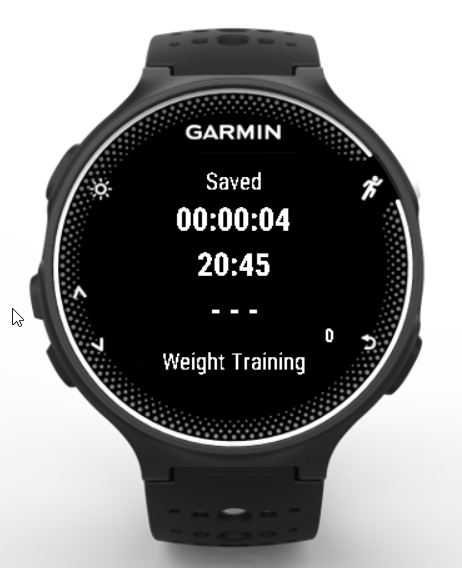

# SportTimerHR

SportTimerHR is application for Garmin sport watches to recording activity for sport (currently version):
- Weight training
- Squash

## Used 
Monkey C language.

## Supported Garmin Devices (sport watches)
- Forerunner® 230
- Forerunner® 235
- Forerunner® 630
- Forerunner® 735XT 

## Application is currently saving:
- sport type
- activity time
- heart rate

During the training you can use counter (use laps button)

## Permissions
This app requires access to:
- FIT files (activity recordings)
- Record additional information into activity files
- Sensor data (i.e., ANT+, heart rate, compass)

## Displayed on  screen:
- status (Ready, Started, Stopped, Saved),
- training time,
- current time,
- heart rate,
- counter (number on right site),
- current sport,

## Screenshots

